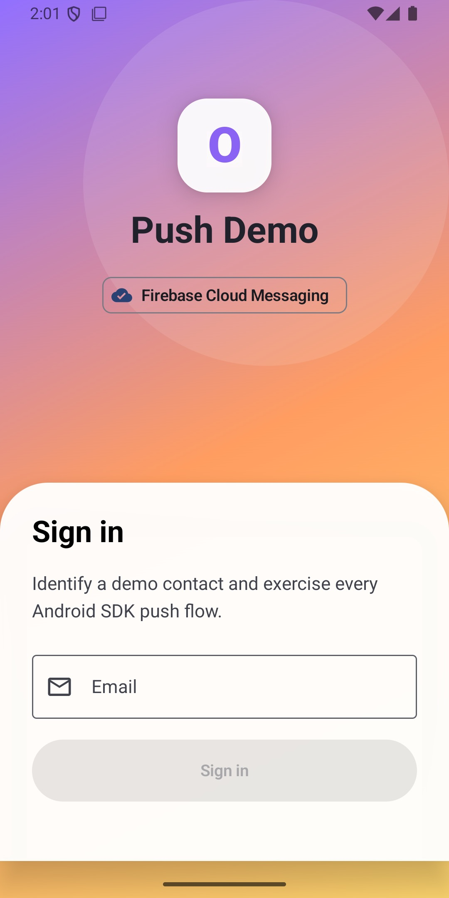
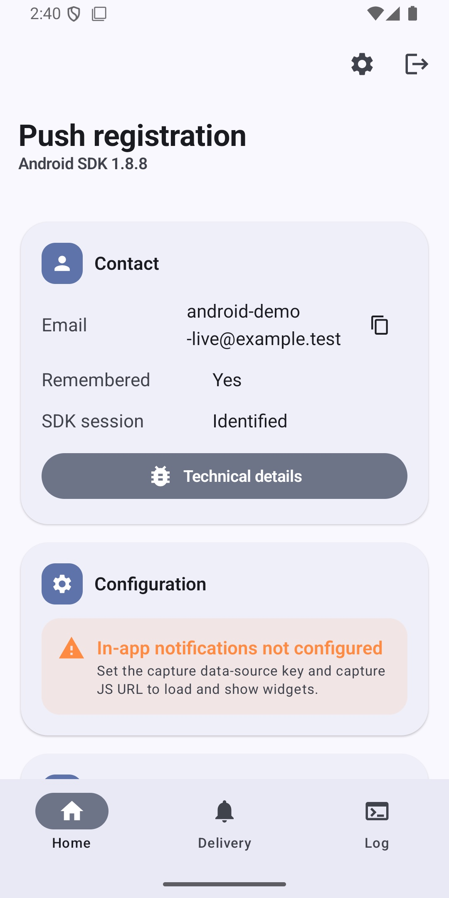
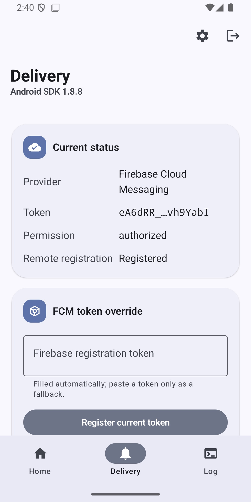
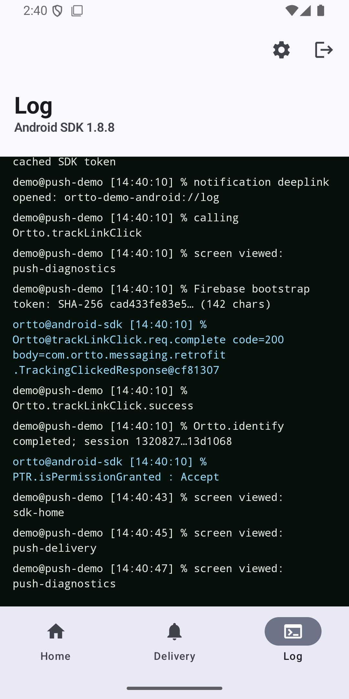

<div align="center">

# Ortto Android SDK Push Demo

**A reference integration shipped beside the Ortto Android SDK.**

FCM permission · token registration · session identity · notification delivery · link-click tracking · in-app notifications

[](https://developer.android.com/)
[](https://kotlinlang.org/)
[](https://developer.android.com/compose)
[](https://m3.material.io/)

</div>

## Screenshots

| Login | Home | Delivery | Log |
| --- | --- | --- | --- |
|  |  |  |  |

## Quick start

Prerequisites: Android Studio with JDK 17 or 18, Android SDK 34, an Ortto FCM app key, and a Firebase Android app registered for `com.ortto.demo`.

```sh
cp demo/local.properties.example demo/local.properties
cp demo/google-services.json.example demo/google-services.json
```

Replace the placeholders in both copied files. The real files are gitignored. Then run the app from Android Studio, or from the repository root:

```sh
VERSION_NAME=1.8.8 ./gradlew :demo:installDebug
adb shell am start -n com.ortto.demo/.MainActivity
```

The module uses `implementation project(':messaging')`, so it always runs the SDK source in this checkout. The app header shows the SDK version supplied through `VERSION_NAME`.

## What it demonstrates

The Android app mirrors the iOS reference demo while using Android-native integration points:

| Flow | Android implementation |
| --- | --- |
| Remembered demo account | `SharedPreferences`, with `Ortto.identify` on sign-in and `clearIdentity` on sign-out |
| Push permission | Android 13+ runtime `POST_NOTIFICATIONS` permission, then `Ortto.setPermission` |
| FCM registration | `Ortto.getFirebaseToken`, `registerDeviceToken`, and cached-token `dispatchPushRequest` |
| Notification receipt | SDK `FirebaseMessageReceiver` renders data-message notifications, including rich images and actions |
| Notification tap | SDK custom deep-link callback returns to the existing `MainActivity`; tracked links call `trackLinkClick` |
| Screen tracking | Home, Delivery, and Log emit `Ortto.screen` events |
| In-app notifications | Optional Capture initialization, widget discovery, and `showWidget` |
| Diagnostics | Sanitized terminal log, token fingerprints, configuration checks, and copyable support values |

The UI is built with Material 3 and edge-to-edge Compose. It uses bottom navigation on phones and switches to a navigation rail at expanded widths.

## App tour

- **Login** identifies an email-address contact and remembers it for repeat tests.
- **Home** summarizes the contact, SDK session, FCM token, permission, backend registration, and configuration health.
- **Delivery** exposes token registration/override, cached-token redispatch, permission refresh, tracked-link handling, and in-app widget controls.
- **Log** combines app and SDK events in a sanitized terminal-style stream. Full FCM tokens and app keys are not written to it.
- **Technical details** provides support-ready SDK, endpoint, package, session, token fingerprint, notification-channel, and config state.

## Configuration

`demo/local.properties` accepts these values:

| Field | Required | Purpose |
| --- | --- | --- |
| `ortto.apiEndpoint` | yes | Ortto capture endpoint, including the local Pushover endpoint during isolated tests |
| `ortto.appKey` | yes | FCM application key |
| `ortto.captureDataSourceKey` | widgets only | Capture data-source key |
| `ortto.captureJsUrl` | widgets only | Account-specific Capture script URL |

The same values can be supplied as `ORTTO_API_ENDPOINT`, `ORTTO_APP_KEY`, `ORTTO_CAPTURE_DATA_SOURCE_KEY`, and `ORTTO_CAPTURE_JS_URL`. Environment variables take precedence.

Put the Firebase Android configuration at `demo/google-services.json`. Do not commit either real configuration file.

### Local Pushover backend

For a backend-isolated emulator run, point the app at the host machine through the emulator loopback bridge:

```properties
ortto.apiEndpoint=http://10.0.2.2:3000/
ortto.appKey=<local-test-app-key>
```

The manifest permits cleartext traffic so this local-only path works. Release consumers should continue to use their HTTPS Ortto endpoint.

## Test flow

1. Clear app data for an unambiguous first-open run.
2. Launch the app and grant notification permission.
3. Sign in with a test email; confirm an Ortto session is created.
4. Register the acquired FCM token and verify the exact device registration at the selected backend.
5. Open Delivery and redispatch the cached token.
6. Send a targeted FCM data notification containing an Ortto notification ID, delivery tracker, and tracked primary-action deep link.
7. Confirm the Android notification appears while the app is backgrounded.
8. Tap it; confirm the intended tab opens, `Ortto.trackLinkClick.success` appears in Log, and backend delivered/opened/clicked events are recorded.
9. Exercise a rich image/action payload and optional Capture widget where those fixtures are configured.
10. Sign out and repeat to verify local state is cleared.

Run the automated checks with:

```sh
VERSION_NAME=1.8.8 ./gradlew :demo:testDebugUnitTest :demo:lintDebug :demo:assembleDebug
VERSION_NAME=1.8.8 ./gradlew :demo:connectedDebugAndroidTest
```

The JVM tests cover parsing, tab routing, redacted token fingerprints, and display helpers. The Compose instrumentation test proves the fresh-login experience and all Home, Delivery, and Log destinations.

With local Pushover and Firebase configuration present, run the explicitly gated live registration test by itself so its installed Firebase token is not invalidated by a later test reinstall:

```sh
VERSION_NAME=1.8.8 ./gradlew :demo:connectedDebugAndroidTest \
  -Pandroid.testInstrumentationRunnerArguments.pushoverE2E=true \
  '-Pandroid.testInstrumentationRunnerArguments.class=com.ortto.demo.DemoAppTest#pushoverFcmRegistrationFlow'
```

## Project layout

```text
demo/
├── build.gradle                         App dependencies and gitignored configuration bridge
├── local.properties.example             Ortto/Capture configuration template
├── google-services.json.example         Firebase configuration shape
└── src/
    ├── main/
    │   ├── AndroidManifest.xml           Permission, application, activity, and deep-link setup
    │   └── java/com/ortto/demo/
    │       ├── DemoApplication.kt        SDK, Capture, channel, and deep-link initialization
    │       ├── MainActivity.kt           Permission contract and Compose host
    │       ├── DemoViewModel.kt          All SDK flows and app state
    │       ├── DemoApp.kt                Material 3 login, tabs, actions, and diagnostics
    │       ├── DemoConfig.kt             Typed BuildConfig values and validation
    │       ├── DemoLogic.kt              Pure link/token display logic
    │       ├── DemoLog.kt                Sanitized combined SDK/app log
    │       ├── DemoModels.kt             Navigation and UI models
    │       └── Theme.kt                  Adaptive Material color and typography
    ├── test/                             Deterministic JVM tests
    └── androidTest/                      Compose emulator UI test
```

## Troubleshooting

| Symptom | Likely cause |
| --- | --- |
| Configuration card reports missing Ortto values | Create `demo/local.properties` from the example and rebuild |
| Firebase token never appears | Register `com.ortto.demo` in Firebase and add its real `google-services.json` |
| Local backend cannot be reached | Use `10.0.2.2`, not `localhost`, from the Android emulator |
| Notification is delivered but not visible | Grant app notification permission and confirm the `ortto_push` channel is enabled |
| Tap opens but does not track | The deep link must contain a non-empty, URL-encoded `tracking_url` query parameter |
| Widget list is empty | Configure Capture, sign in first, and confirm the endpoint/data-source key belong together |

---

<div align="center"><sub>Part of the Ortto Android SDK — covered by the SDK's license.</sub></div>
